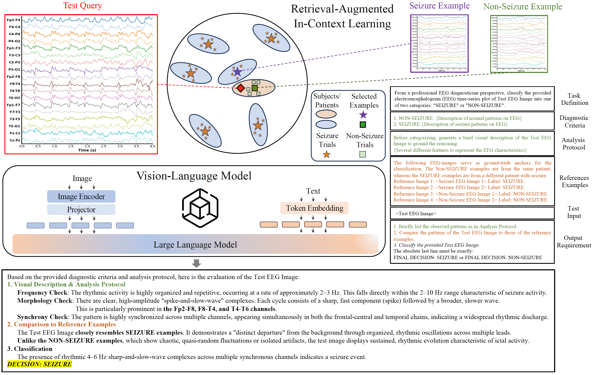

#  EEG Seizure Detection via Vision-Language Models with Retrieval-Augmented In-Context Learning

<p align="center">
  
</p>

---
This repository contains the **official code** for the paper.  
It introduces a **new paradigm for EEG decoding** that:

- Converts multichannel EEG signals into **stacked waveform images**
- Uses **off-the-shelf Vision-Language Models (VLMs)** without training
- Injects **clinical EEG expertise via structured prompts**
- Improves robustness using **Retrieval-Augmented In-Context Learning (RAICL)**

---

## 🔍 Key Idea

Instead of learning task-specific neural networks on raw EEG signals, we:

1. **Render EEG time series as waveform images**
2. **Embed images using pretrained visual encoders**
3. **Query a VLM with retrieved few-shot EEG examples**
4. **Perform seizure detection via multimodal reasoning**

This enables **zero-training, zero-fine-tuning, task-zero-shot EEG-based seizure detection**.

---

## 🧩 Repository Structure

```text
.
├── environments.yml        # The python environment required
├── plot_timechan.py        # EEG → stacked waveform image rendering
├── extract_feature.py      # Visual embedding extraction using CLIP model
├── query_api_raicl.py      # RAICL-based VLM querying using Gemini-3-Flash
├── prompt-Z.txt            # The prompt used in paper
├── response/               # Full Gemini responses to two seizure Datasets
├── prompt-xxx.txt          # other prompts variations studied in the paper
└── README.md
```

## Contact

Please contact me at syoungli@hust.edu.cn or lsyyoungll@gmail.com for any questions regarding the paper, and use Issues for any questions regarding the code.

## Citation

If you find this repo helpful, please cite our work:
```
@Article{Li2026,
  author  = {Li, Siyang and Wang, Zhuoya and Gui, Xiyan and Chen, Xiaoqing and Wang, Ziwei and Wen, Yaozhi and Wu, Dongrui},
  title   = {EEG Seizure Detection via Vision-Language Models with Retrieval-Augmented In-Context Learning},
  year    = {2026},
}
```