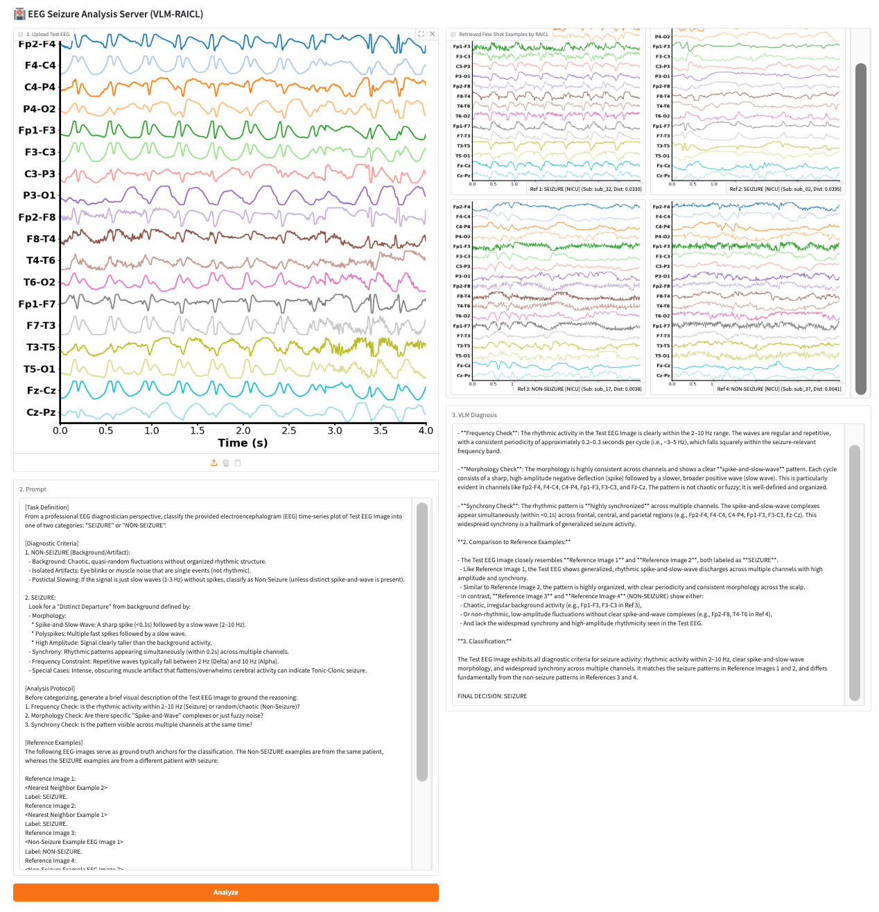

#  RAICL: Retrieval-Augmented In-Context Learning for Vision-Language-Model Based EEG Seizure Detection

<p align="center">
  
</p>

---
This repository contains the **official code** for the paper.  
It introduces a **new paradigm for seizure EEG analysis** that:

- Converts multichannel EEG signals into **stacked waveform images**
- Uses **off-the-shelf Vision-Language Models (VLMs)** without training
- Injects **clinical EEG expertise via structured prompts**
- Improves robustness using **Retrieval-Augmented In-Context Learning (RAICL)**

---

## 🔍 Key Idea

Instead of learning task-specific neural networks on raw EEG signals, we:

1. **Render EEG time series as waveform images**
2. **Embed images using pretrained visual encoders**
3. **Query a VLM with retrieved few-shot EEG examples**
4. **Perform seizure detection via multimodal reasoning**

This enables **zero-training, zero-fine-tuning, task-zero-shot EEG-based seizure detection**.

---

## 🧩 Repository Structure

```text
.
├── environments.yml        # The python environment required
├── response/               # Full Gemini responses to two seizure Datasets
├── plot_timechan.py        # EEG → stacked waveform image rendering
├── extract_feature.py      # Visual embedding extraction using CLIP model
├── query_api_raicl.py      # RAICL-based VLM querying using Gemini-3-Flash
├── prompt-Z.txt            # The prompt used in paper
├── prompt-xxx.txt          # other prompts variations studied in the paper
└── README.md
```

## Example Usage

To plot the stacked waveform EEG image, please read comments in plot_timechan.py and supply the necessary data files
```sh 
python plot_timechan.py
```   

Then, to extract features using e.g. CLIP visual encoder, please read comments in extract_feature.py
```sh 
python extract_feature.py
```   

Finally, to query API e.g. Gemini-3-Flash, need the key of your own. Please read comments in query_api_raicl.py
```sh 
python query_api_raicl.py --api_key xxx --dataset CHSZ --data_dir xxx
```   

To continue querying from an unfinished .csv file:
```sh 
python query_api_raicl.py --api_key xxx --dataset CHSZ --data_dir xxx --rerun_timestamp xxx/response/Gemini-3-Flash/NICU/NICU_Flash_TypeZ_NnMedoid_N2_representative_20260117_100250.csv
```   

To evaluate metrics from a saved .csv file:
```sh 
python query_api_raicl.py --dataset CHSZ --test_file xxx/response/Gemini-3-Flash/NICU/NICU_Flash_TypeZ_NnMedoid_N2_representative_20260117_100250.csv
```   

## Web-APP-like Demo

<p align="center">
  
</p>

## Contact

Please contact me at syoungli@hust.edu.cn or lsyyoungll@gmail.com for questions regarding the paper/research, and use Issues tab for questions regarding the code.

## Citation

If you find this repo helpful, please cite our work:
```
@Article{Li2026,
  author  = {Li, Siyang and Wang, Zhuoya and Gui, Xiyan and Chen, Xiaoqing and Wang, Ziwei and Wen, Yaozhi and Wu, Dongrui},
  title   = {RAICL: Retrieval-Augmented In-Context Learning for Vision-Language-Model Based EEG Seizure Detection},
  year    = {2026},
  journal = {arXiv preprint arXiv:2601.17844}
}
```